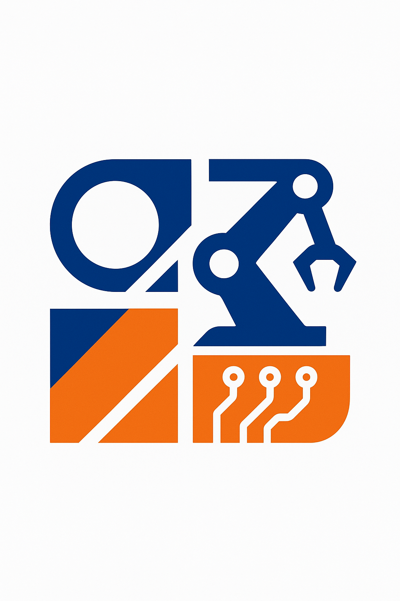
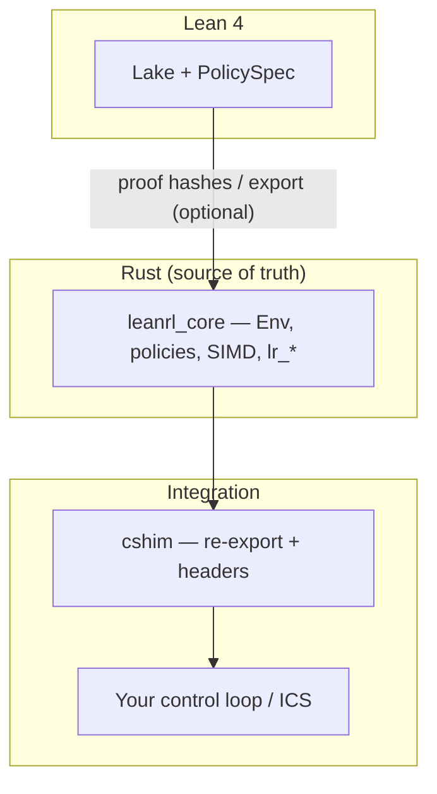

<div align="center">

# LeanEdge-RL

*A small, fast reinforcement-learning runtime for safety-conscious edge systems—Rust at the core, Lean 4 on the path to proof.*

[](https://github.com/leanrl/leanedge-rl/actions/workflows/ci.yml)
[](rust-toolchain.toml)
[](LICENSE-MIT)

<br />



<sub>If the image is missing, add <code>LeanEdge-RL.png</code> under <a href=".github/assets/README.md"><code>.github/assets/</code></a>.</sub>

</div>

---

## At a glance

LeanEdge-RL is a **Rust workspace** for embedding compact RL policies where latency, footprint, and traceability matter: industrial control, robotics, and PLC-class controllers. The **authoritative runtime** is [`leanrl_core`](core/) (`no_std`-capable with optional `std`). Formal specs and export workflows live in **[`lean/`](lean/)** and are documented in [Formal verification (Lean 4)](docs/formal-verification.md).

> **Intent:** ship predictable inference on the edge today, while growing proofs, bundles, and compliance hooks alongside the code—not as an afterthought.

---

## Highlights

| | |
|:---|:---|
| **Latency goal** | P99 ≤ 100 µs on Cortex-A53 @ 1.4 GHz (target—validate on your hardware) |
| **Verification** | Lean 4 Lake library ([`PolicySpec`](lean/)); proofs and export evolve over time |
| **Runtime modes** | Default `std`; embedded builds via `--no-default-features` where supported |
| **SIMD** | AVX2 (x86_64) and NEON (aarch64) via `std::arch`, with scalar fallback |
| **Targets** | aarch64, armv7 GNU, thumbv7em—see CI and [`.cargo/config.toml`](.cargo/config.toml) |
| **Algorithms** | Tabular Q-learning, linear approximation, tiny neural networks |
| **Tooling** | [`leanrl-bundle`](leanrl-bundle/) (SBOM ZIP, signing hooks), `cargo deny` / audit in CI |

---

## Project status

**Active development.** The pinned toolchain is [rust-toolchain.toml](rust-toolchain.toml). CI runs `rustfmt`, Clippy (`-D warnings`), workspace tests, `cargo deny`, cross-target builds, Lean `lake build`, and a small C++ GTest compile. Release notes appear on [GitHub Releases](https://github.com/leanrl/leanedge-rl/releases) when published.

| Crate / tree | Role |
|:-------------|:-----|
| [`core/`](core/) | `leanrl_core`: policies, SIMD helpers, stable C API (`lr_*` in [`ffi.rs`](core/src/ffi.rs)) |
| [`cshim/`](cshim/) | Re-exports core; C++-oriented headers in [`leanrl.hpp`](cshim/include/leanrl.hpp)—integrate via **C API** or your own C++ layer |
| [`leanrl-bundle/`](leanrl-bundle/) | Compliance bundle CLI (async with `tokio`) |
| [`lean/`](lean/) | Minimal Lean 4 Lake library around `PolicySpec` |

---

## Quick start

### Rust

```rust
use leanrl_core::{Env, Obs, Action};

let mut env = Env::<4, 2>::from_weights(&weights)?;
let obs = Obs::new([1.0, 2.0, 3.0, 4.0]);
let action = env.reset(&obs);
let next_action = env.step(&obs);
```

### C API (recommended for FFI)

Build `leanrl_core` as `cdylib` or `staticlib` and call the stable `lr_*` surface (`lr_init` → `lr_reset` / `lr_step` → `lr_free`). See your generated header or the bundle’s C header sketch in [`leanrl-bundle`](leanrl-bundle/src/bundle.rs).

### C++

Headers live under [`cshim/include/leanrl.hpp`](cshim/include/leanrl.hpp). The **supported** boundary is the **C API** from `leanrl_core`; the C++ header is a façade sketch. A CMake + GoogleTest placeholder lives in [`cshim/cpp_tests`](cshim/cpp_tests).

```cpp
#include "leanrl.hpp"

// Production FFI should wrap lr_* from leanrl_core.
auto env = leanrl::Env4x2(weights_vector);
auto action = env.reset(obs_array);
```

---

## Architecture



---

## Building

**Prerequisites**

- **Rust:** stable + `rustfmt` + `clippy` (see [rust-toolchain.toml](rust-toolchain.toml))
- **Cross:** linker/toolchain for your triple (e.g. `aarch64-linux-gnu-gcc`); optional [Cross](Cross.toml)
- **Lean:** only when working in [`lean/`](lean/) (`elan`, then `lake build`)
- **C++ tests:** CMake 3.20+; CI fetches GoogleTest via FetchContent

<details>
<summary><strong>Common commands</strong> (expand)</summary>

```bash
# Workspace
cargo build
cargo build --release

# SIMD (must match host/target arch)
cargo build -p leanrl_core --release --features simd_avx2    # x86_64
cargo build -p leanrl_core --release --features simd_neon    # aarch64

# Cross-compile (toolchain + linker required)
cargo build --release --target aarch64-unknown-linux-gnu

# Core only, embedded-style
cargo build -p leanrl_core --release --target thumbv7em-none-eabi --no-default-features

# Tests & benches
cargo test --workspace
cargo test -p leanrl_core --test smoke
cargo bench -p leanrl_core

# Compliance bundle (signing only if configured)
cargo run -p leanrl-bundle -- generate

# Same gates as CI
cargo fmt --all -- --check
cargo clippy --workspace --all-targets --all-features -- -D warnings
```

</details>

---

## Algorithms

- **Tabular Q-learning** — discrete state/action flavor, epsilon-greedy exploration, configurable learning rate and discount.
- **Linear function approximation** — continuous observations, linear layer + bias, gradient-style updates.
- **Tiny neural networks** — compact MLP-style policies; see `TinyNN` in the crate docs.

---

## Compliance and safety

Design goals include SBOMs, signed bundles, and stronger runtime invariants. **Current state:**

- **SBOM:** produced by `leanrl-bundle` (SPDX-style JSON).
- **Signing / TPM:** hook points exist; wire secrets such as `LEANRL_BUNDLE_SIGN` in CI where applicable.
- **Safety checks:** `Env::check_invariant`, bounds checks on the C API path—expand as specs mature.

References to ISO 26262 / DO-178C reflect **design intent** until you run a qualified process on a frozen release.

---

## Performance targets

| Dimension | Target |
|:----------|:-------|
| Latency | P99 ≤ 100 µs on Cortex-A53 @ 1.4 GHz |
| Code size | ≤ ~350 kB library (configuration-dependent) |
| Static weights | ≤ ~256 kB typical |
| RAM | ≤ ~1 MB total (policy-dependent) |
| SIMD | Higher throughput on AVX2 / NEON vs scalar |

Always measure on your binary, feature set, and compiler.

---

## License

- **Code:** [MIT](LICENSE-MIT) **or** [Apache-2.0](LICENSE-APACHE), at your option.
- **Specifications** (e.g. Lean sources): CC-BY-4.0 unless noted otherwise.

---

## Contributing

See [CONTRIBUTING.md](CONTRIBUTING.md). New `unsafe` is restricted to allowlisted files and CI; see [scripts/verify-unsafe-allowlist.sh](scripts/verify-unsafe-allowlist.sh).

---

## Roadmap

- **Q1 2026:** Harden CI (e.g. cross-rs), proof-hash wiring in bundles, docs.rs polish
- **Q2 2026:** Optional `cxx` bridge or stable C++ wrappers over `lr_*`
- **Later:** Policy-export crate or Lake submodule under `lake-packages/`

